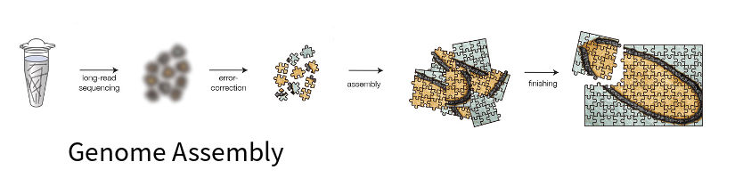
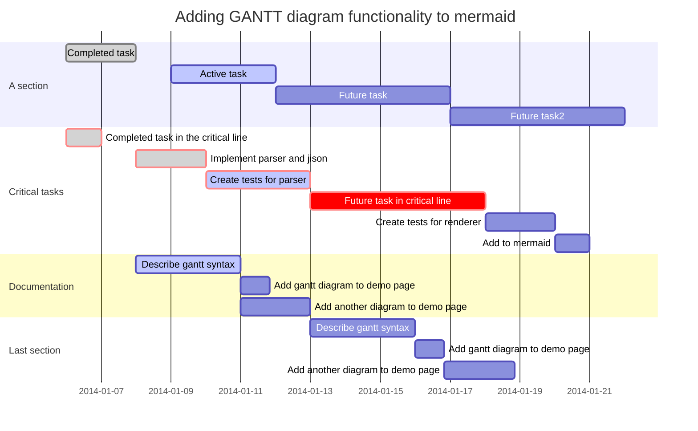
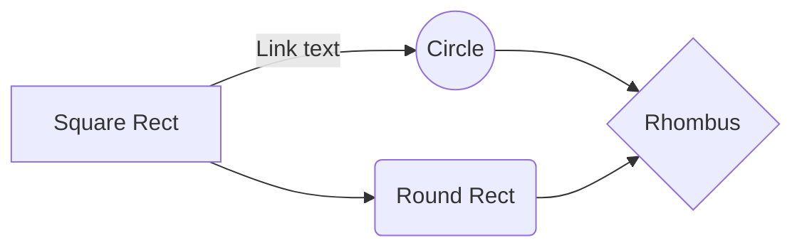
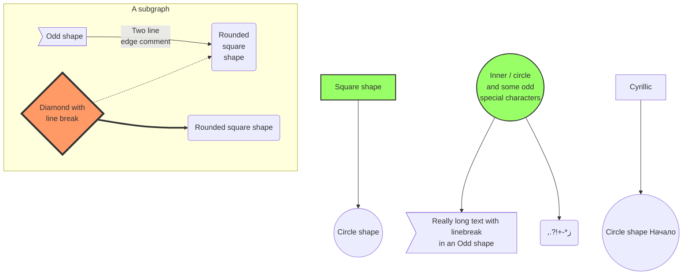
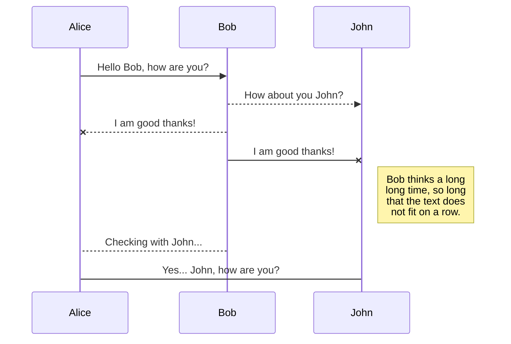
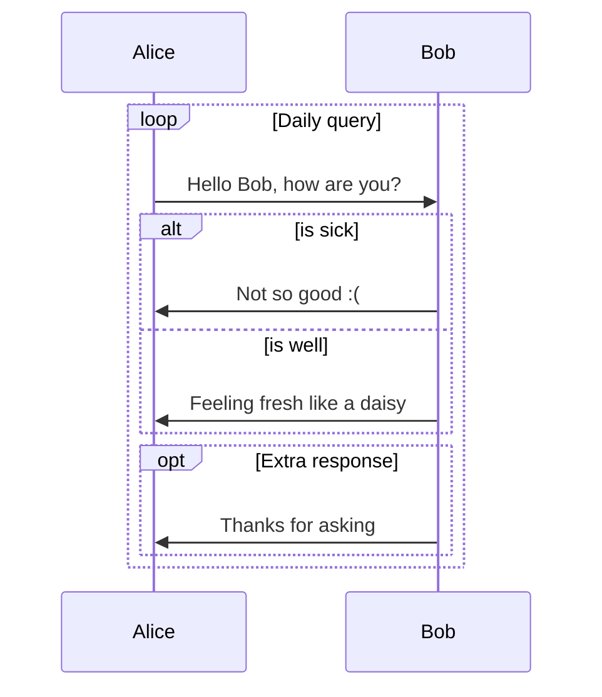

# Genome Assembly



因为微生物一般是单倍体，基因组较小，重组频繁，所以常采用基因组测序了解其遗传信息。


序列拼接方法：

  - OLC(Overlap Layout Consensus):
  - DBG(De Bruijn Graph):
  - String:










```flow
st=>start: Start:>http://www.google.com[blank]
e=>end:>http://www.google.com
op1=>operation: My Operation
sub1=>subroutine: My Subroutine
cond=>condition: Yes
or No?:>http://www.google.com
io=>inputoutput: catch something...

st->op1->cond
cond(yes)->io->e
cond(no)->sub1(right)->op1
```

## Reference

1. [Homologs De Bruijn Assembly Tutorial](http://homolog.us/Tutorials/index.php?p=1.1&s=1)
2. [EMBL-EBI Training: De Bruijn Assembly]
3. [Ben Langmead's De Bruijn Graph Assembly](http://www.cs.jhu.edu/~langmea/resources/lecture_notes.assembly_dbg.pdf)
