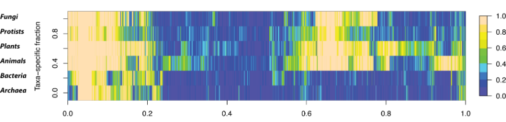

# Pan-Genome 的



对于微生物基因组，首先对于 homolog, ortholog 和 paralog 的概念需要明确，以前看书的时候容易对定义有所忽略，[这篇博客](http://blog.sciencenet.cn/blog-217859-280960.html)讲述的比较清楚。参考资料[^1] [^2] [^3]

!!! note "**Homolog** 同源（基因）"
    A gene related to a second gene by descent from a common ancestral DNA sequence. The term "homolog" may apply to the relationship between genes separated by speciation (ortholog), OR to the relationship betwen genes originating via genetic duplication (see paralog).

指遗传上来自于某一共同祖先DNA序列的基因。“同源”包含两种情况，一是物种间的同源（ortholog）；另一种是同一物种内由于基因复制、分离导致的同源（paralog）。

!!! note "**Ortholog** 直系／直向／垂直同源（基因）"
    Orthologs are genes in different species that have evolved from a common ancestral gene via speciation (1). Orthologs often (but certainly not always) retain the same function(s) in the course of evolution (2). Thus, functions may be lost or gained when comparing a pair of orthologs.

指位于不同的物种间的，在物种形成过程中源自某一共同祖先的基因。从进化的角度来看，这类基因通常具有相同的功能，但并非绝对。所以，当我们比较一对直系同源基因时，可能会发现有的已经丧失了固有的功能或者进化出了新的功能。

!!! note "**Paralog** 旁系／横向／并行同源（基因）"
    Paralogs are genes produced via gene duplication within a genome (1). Paralogs typically evolve new functions or else eventually become pseudogenes.

指在一个特定的基因组中由于基因复制产生的同源。通常比较这些基因时，它们可能已经彼此具有了新的（不同）功能，也可能已经成为假基因了。

---

## 1. Pangenome 分析软件

Pan-Genome 分析的工具可以参看 omictools 的 pan-genome 工具列表，里面罗列了许多软件，大部分都是通过构建自己的pipeline来实现。常见的工具有以下这些：

* [Panseq][]
* [PGAP][]
* [ITEP][]
* [BPGA][]
* [Get_Homologues][]
* [Spine](http://vfsmspineagent.fsm.northwestern.edu/cgi-bin/spine.cgi)
* [Roary](https://github.com/sanger-pathogens/Roary)
* [Harvest](https://github.com/marbl/harvest)
* [Panseq](https://github.com/chadlaing/Panseq)

## 2. 数据与硬件

这一部分我们选择 [NCBI][] [Assembly][] 数据库中 Bacillus cereus 菌的序列完成图菌株的基因组共计25株的 genbank 格式文件来进行分析。

```bash
# 下载数据 Bacillus cereus 基因组完成序列
$ esearch -db assembly -query 'txid1396[ORGN:noexp] AND latest[filter] AND "complete genome"[filter]' | efetch -format docsum | \
> xtract -pattern DocumentSummary -element FtpPath_RefSeq | \
> awk -F'/' '{print $0"/"$NF"_genomic.gbff.gz"}' > ftp-path.txt
# wget工具下载refseq ftp上的数据
$ wget -i ftp-path.txt --no-passive-ftp
# 解压缩.gz文件并且将gbff后缀修改为gbk
$ gunzip *.gz && rename 's/\.gbff$/\.gbk/' *.gbff
# 将文件名修改为菌株名称
$ for i in *.gbk; do mv $i `head -2 $i | awk '/DEFINITION/' | \
> awk '{print $5,$6".gbk"}' | sed 's/,//g' | sed 's/ complete//g'`; \
> done
```

在一台128G + 40 threads的电脑上进行测试，对于支持多线程的程序，都采用最大的40个进程进行计算。

---

## 3. 分析

### 3.1 [Get_Homologues][]

[Get_Homologues][] 是一个用 perl 语言编写的用来鉴定细菌 core-genomes 和 pan-genomes 的开源工具[^5]。

```bash
# 默认使用 blast 进行序列相似性搜索，为了加快速度，添加 -X 参数调用 diamond
# 进行序列相似性搜索
$ get_homologues.pl -d gbk_folder -n 40 -X
```

具体使用方法参见软件Maunal[^6]。

### 3.2 [BPGA][]

[BPGA][] 是由印度 [CSIR-Indian Institute of Chemical Biology](http://www.iicb.res.in/) 研究人员开发的用于细菌 Pangenome 分析工具流。

[BPGA][] 依赖第三方软件，用 [USEARCH][] 构建聚类，用 [Muscle][] 进行多重序列比对。用 [gnuplot][] 和 [ghostscript][] 生成结果图片或pdf文件。

**输入数据**

* .faa 蛋白质序列文件
* .pep.fsa HMP蛋白数据文件
* .gbk/gb [Genbank][]蛋白质序列文件

**使用方法**

BPGA 采用了类似phylip式的交互式运行方式。

```
$ BPGA-Version-1.3
```

运行程序后，会进入菜单选择界面，一般可以分2步走：

1. 按 1 选择输入文件格式
2. 按 2 进入 Pangenome 分析

按 0 退回上一级菜单

**结果文件**

生成的数据包括根目录下的文件和Results、Sequences 和 Supporting_files 3个子文件夹内结果文件

Results文件夹内主要包含分析结果生成的图：

| 结果文件 | 数据内容 |
| -------- | -------- |
| COG_DISTRIBUTION_DETAILS.pdf | core, accessory, unique 3种类型基因在COGS各个分类中的分布比值 |
| COG_DISTRIBUTION.pdf | core, accessory, unique 3种类型基因在COGS中总的分布比值 |
| Core_Pan_Dot_Plot.pdf | pangenome 和 coregenome 点阵趋势图 |
| Core_Pan_Plot.pdf | pangenome 和 coregenome boxplot趋势图 |
| curve.xls | pangenome 和 coregenome 基因数计算公式和物种的基因估计值，文本格式 |
| Default_Core_Pan_Plot.pdf | pangenome 和 coregenome 趋势图 |
| Histogram.pdf | 各个分析菌株所含基因家族的直方图分布 |
| KEGG_DISTRIBUTION_DETAILS.pdf | pdf 格式的 KEGG 详细分类基因的 core, accessory 和 uniq genes 数量分布 |
| KEGG_DISTRIBUTION.pdf | pdf 格式的 KEGG 主要分类基因的 core, accessory 和 uniq genes 数量分布|
| New_Genes_Plot.pdf | 分析菌株所含 New genes 数量分布 |
| Pan_phylogeny.pdf | pdf 格式的分析菌株提供发生树图|
| Pan_phylogeny.svg | svg 格式的分析菌株系统发生树图 |
| stats.xls | 所有分析菌株含有的 core, accessory, unique 和 exclusively absent 基因。虽然后缀为.xls，文本格式 |

Sequences 文件夹内包含：

| 结果文件 | 数据内容 |
| -------- | -------- |
| accessory_seq.txt | accessory 基因的序列 |
| core_genes_with_atypical_GC_content.txt | 进行了 atypical GC 分析后产生， core 基因的序列 |
| core_seq.txt | uniq 基因的序列 |
| exclusively_absent_seq.txt | exclusively absent 基因的序列 |
| REPSEQ_ACCESSORY.txt | |
| REPSEQ_CORE.txt | |
| REPSEQ_UNIQUE.txt | |
| unique_genes_with_atypical_GC_content.txt | 进行了 atypical GC 分析后产生， uniq 基因的序列 |
| unique_seq.txt | uniq 基因的序列 |

Supporting_files 文件夹包含：

| 结果文件 | 数据内容 |
| -------- | -------- |
| ACCESSORY_COG_hits3.txt | |
| ACCESSORY_kegg_hits3.txt | |
| Cog_Category1.txt | |
| CORE_COG_hits3.txt | |
| core_default.txt | |
| core_genome.txt | |
| CORE_kegg_hits3.txt | |
| DATASET.xls | |
| histogram.txt | |
| kegg_accessory_id.txt | |
| kegg_accessory_out.txt | |
| kegg_core_id.txt | |
| kegg_core_out.txt | |
| Kegg_count_details1.txt | |
| kegg_histogram1.txt | |
| kegg_unique_id.txt | |
| kegg_unique_out.txt | |
| list | |
| Major_Cog_Category1.txt | |
| matrix.txt | |
| new_genes_count.txt | |
| pan_default.txt | |
| pan_genome.txt | |
| PAN_PHYLOGENY_MOD.nwk | |
| PAN_PHYLOGENY_MOD.ph | |
| PAN_PHYLOGENY.ph | |
| plots_default.plt | |
| plots.plt | |
| u_clusters.txt | |
| UNIQUE_COG_hits3.txt | |
| UNIQUE_kegg_hits3.txt | |

### 3.3 Roary

**输入数据**

Roary 的输入端需要 gff 格式的数据文件。由于 NCBI 下载的 gff 是不含核酸序列的 gff 格式文件，无法直接用来分析。Prokka 生成的 gff 格式文件包含核酸序列，所以可以下载 NCBI 上的 fna 文件然后用 prokka 注释后再用 roary 分析。

```bash
$ sed -i 's/.gbff/.fna/g' ftp-path.txt
$ wget -i ftp-path.txt --no-passive-ftp
$ gunzip *.gz
# 将 Assembly 文件名修改为菌株名称
$ for i in *.fna; do mv $i `head -1 $i | awk '{print $5, $6}' | awk -F',' '{print $1".fna"}' | sed 's/CMCC /CMCC-/g'`; done
# prokka 进行注释并以菌株名为文件夹名输出
$ for i in *.fna; do k=`echo $i | sed 's/.fna//g'` && prokka $i --prefix $k -outdir $k --cpus 40; done
# 复制出 gff 文件到 gff_folder 中，由 roary 进行分析
$ cp */*.gff gff_folder/; done
```

**使用方法**

roary 用 blastp 对 gff 文件中的序列进行 orthologs 分析，获得 pangenome 和 coregenome 结果，还可以使用 mafft 对核心基因组进行序列比对，生成系统发生树。

```bash
$ roary -e --mafft -p 40 gff_folder/*.gff -f roary
```

**结果文件**

roary生成的结果文件：

| 结果文件 | 数据内容 |
| -------- | -------- |
| accessory_binary_genes.fa | |
| accessory_binary_genes.fa.newick | |
| accessory_graph.dot | |
| accessory.header.embl | |
| accessory.tab | |
| blast_identity_frequency.Rtab | |
| clustered_proteins | |
| core_accessory_graph.dot | |
| core_accessory.header.embl | embl 格式的文件显示各 accessory 基因|
| core_accessory.tab | accessory 基因在所在的基因组 |
| core_alignment_header.embl | |
| core_gene_alignment.aln | |
| core_gene_alignment.aln.reduced | |
| gene_presence_absence.csv | csv 格式的基因在各个基因组中是否存在的数据文件 |
| gene_presence_absence.Rtab | Rtab 格式的基因在各个基因组中是否存在的数据文件 |
| number_of_conserved_genes.Rtab | Rtab 格式的不同数量基因组所共有基因数 |
| number_of_genes_in_pan_genome.Rtab | Rtab 格式的不同数量基因组的所有基因数 |
| number_of_new_genes.Rtab | Rtab 格式的不同数量基因组所新增的基因数 |
| number_of_unique_genes.Rtab | Rtab 格式的不同数量基因组所特有基因数 |
| pan_genome_reference.fa | |
| summary_statistics.txt | pangenome 分析各种基因数量结果 |

### 3.4 Panseq


```bash
$ ./panseq.pl
```

### 3.5 ITEP

[ITEP][] 是一组用来分析 Pangenome 的工具集。

### 3.6 OrthMCL

MCL算法是 Markov Cluster Algorithm 算法的缩写。OrthMCL

#### 安装和配置 MySQL

```bash
# 安装和配置 MySQL
$ sudo apt-get install mysql-server-5.6

# 输入 MySQL 管理员用户密码
New password for the MySQL "root" user:
Repear password for the MySQL "root" user:

#安装完后，可以测试 MySQL 是否正常运行：
$ sudo netstat -tap | grep mysql
```

如果能看到`tcp 0 0 localhost:mysql *:* LISTEN port/mysqld `这样的字符输出，表示安装成功。接下来用`mysql`命令建立orthomcl用户和数据库:

```bash
$ mysql -u root -p
```

然后在 `Enter password` 命令行提示符号下输入前面设置的密码，就可以看到 `mysql>` 连接界面了。输入 `select version();` 会打印运行版本，输入 `quit;` 或者 `exit` 退出连接界面。

```mysql
mysql> select version();
+-------------------------+
| version()               |
+-------------------------+
| 5.6.19-0ubuntu0.14.04.1 |
+-------------------------+
1 row in set (0.00 sec)
```

在 mysql 终端建立 orthomcl用户与数据库：

```mysql
# 建立数据库orthomcl的管理用户， 其中'123456' 是用户密码，可以设置成实际需要的
mysql> create user 'orthomcl'@localhost' identified by '123456';
Query OK, 0 rows affected (0.00 sec)

# 创建数据库orthomcl用来储序列数据
mysql > create database orthomcl;
Query OK, 1 rows affected (0.00 sec)

# 分配权限
mysql > grant all on orthomcl.* to 'orthomcl'@'localhost'
Query OK, 0 rows affected (0.00 sec)

# 查看所有的数据库
mysql > show databases;
+---------------------+
| Databases           |
+---------------------+
| orthomcl            |
| ...                 |
+---------------------+
```

#### 安装 mcl

从源代码安装 mcl

```bash
$ wget http://www.micans.org/mcl/src/mcl-latest.tar.gz
$ tar zxvf mcl-latest.tar.gz -C ~/apps
$ mv ~/apps/mcl-14-137 ~/apps/mcl && cd ~/apps/mcl
$ ./configure
$ make
$ sudo make install
```

或者直接安装 ubuntu 编译包，或者通过 conda 工具安装

```bash
$ sudo apt-get install mcl
$ conda install mcl
```

#### 安装 OrthoMCL

```bash
$ wget http://orthomcl.org/common/downloads/software/v2.0/orthomclSoftware-v2.0.9.tar.gz
$ tar zxvf orthomclSoftware-v2.0.9.tar.gz -C ~/apps
$ mv ~/apps orthomclSoftware-v2.0.9 orthomc
```

配置 MySQL 数据库连接

```bash
$ cd ~/apps orthomcl
$ cp doc/OrthoMCLEngine/Main/orthomcl.config.template ./orthomcl.config
$ sudo `pwd`/bin/* /usr/local/sbin/
$ nano orthomcl.config
```

安装perl依赖库，由于bioperl用cpanm貌似装不上，就直接用预编译包安装。

```bash
$ sudo apt-get install bioperl
$ sudo apt-get install cpanminus
$ sudo cpanm DBD::mysql DBI Parallel::ForkManager YAML::Tiny Set::Scalar Text::Table Exception::Class Test::Most Test::Warn Test::Exception Test::Deep Moose SVG Algorithm::Combinatorics
$ cd ~/repos
$ git clone https://github.com/apetkau/orthomcl-pipeline.git
$ orthomcl-setup-database.pl --user orthomcl --password password --host localhost --database orthomcl > orthomcl.conf
```

参考下面内容配置 orthomcl.config 文件：

```bash
# this config assumes a mysql database named 'orthomcl'.  adjust according
# to your situation.
dbVendor=mysql
dbConnectString=dbi:mysql:orthomcl:localhost:mysql_local_infile=1
# for the error of 'the used command is not allowed with this MYSQL version' when importing blast result to mysql, change dbConnectString like this
# dbConnectString=dbi:mysql:orthomcl:mysql_local_infile=1:localhost:3307
# and add local-infile=1 and loose-local-infile=1 1/2 in /etc/mysql/my.cnf
dbLogin=orthomcl
dbPassword=123456
similarSequencesTable=SimilarSequences
orthologTable=Ortholog
inParalogTable=InParalog
coOrthologTablInCoOrtholog
interTaxonMatchView=InterTaxonMatch
percentMatchCutoff=50
evalueExponentCutoff=-5
oracleIndexTblSpc=NONE
```

添加 orthomcl 的 perl 模块到系统 perl 路径

```bash
$ echo "export PERL5LIB=$PERL5LIB:~/apps/orthomcl/lib/perl" > ~/.bashrc
$ source ~/.bashrc
```

用 orthomclInstallSchema 脚本

```bash
$ orthomclInstallSchema orthomcl.config install.log
```

#### 用 orthomcl-pipeline 来简化操作

[orthomcl-pipeline](https://github.com/apetkau/orthomcl-pipeline) 工具可以帮你自动化完成orthomcl的分析过程。

## 结尾


## Reference

[^1]: [Fitch WM (1970) "Distinguishing homologous from analogous proteins". Syst Zool, 19:99-113](https://academic.oup.com/sysbio/article-abstract/19/2/99/1655771/Distinguishing-Homologous-from-Analogous-Proteins)
[^2]: [Li WH, Yang J, Gu X (2005) "Expression divergence between duplicate genes". Trends Genet, 21:602-607](http://www.sciencedirect.com/science/article/pii/S0168952505002337)
[^3]: [科学网 - 陈洪波的博文](http://blog.sciencenet.cn/blog-217859-280960.html)
[^5]: [Bacterial Pangenomics, Methods and Protocols, Chapter14](https://link.springer.com/protocol/10.1007/978-1-4939-1720-4_14)
[^6]: [Get_Homologues Manual](http://eead-csic-compbio.github.io/get_homologues/manual/manual.html)


[NCBI]: https://www.ncbi.nlm.nih.gov
[Assembly]: https://www.ncbi.nlm.nih.gov/assembly/
[Genbank]: https://www.ncbi.nlm.nih.gov/genbank/
[Get_Homologues]: http://eead-csic-compbio.github.io/get_homologues "Get_Homologues"
[BPGA]: http://www.iicb.res.in/bpga/index.html "BPGA"
[ITEP]: https://github.com/mattb112885/clusterDbAnalysis "ITEP"
[USEARCH]: http://www.drive5.com/usearch/
[Muscle]: http://www.drive5.com/muscle/
[gnuplot]: http://www.gnuplot.info/
[ghostscript]: https://www.ghostscript.com/
[Panseq]: https://github.com/chadlaing/Panseq
[PGAP]: https://sourceforge.net/projects/pgap/
